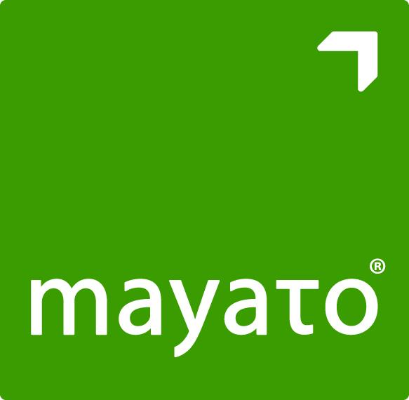
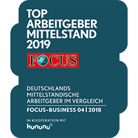
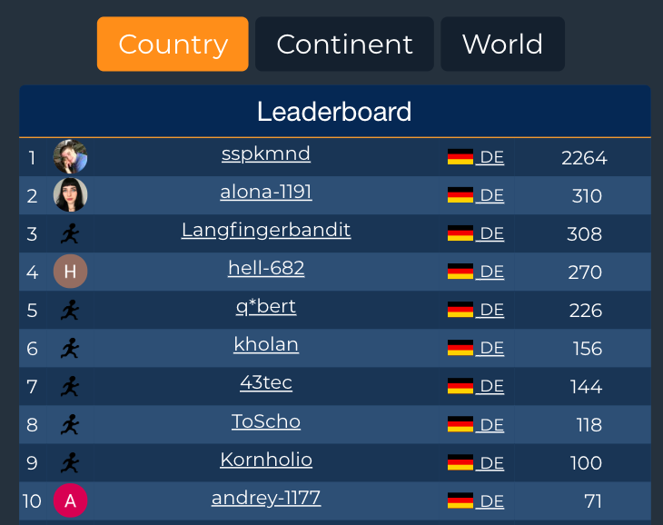

# { .container-sugg }

  SU GG

# Sponsor for today's Meetup

:::::::::::::: {.columns}
::: {.column width="60%"}

[{height=330px style="background:none; border:none; box-shadow:none;" }](https://www.mayato.com/)

:::
::: {.column width="40%"}

[{style="background:none; border:none; box-shadow:none;" }](https://www.mayato.com/focus-top-arbeitgeber-2019/)

:::
::::::::::::::

# Communication

- [LinkedIn](https://www.linkedin.com/company/sas-user-group-germany/)
- [Meetup](https://www.meetup.com/sas-user-group-germany/)
- [sasusergg@gmail.com](mailto:sasusergg@gmail.com)
- [Slack](https://sug-germany.slack.com)

# Survey

 

<https://www.surveymonkey.com/r/2VTZN8W>

---

<!-- # SAS User Groups in Europe -->

:::::::::::::: {.columns}
::: {.column width="50%"}

###### UK & Ireland

[LinkedIn](https://www.linkedin.com/company/suguki/) [meetup](https://www.meetup.com/suguki/)

###### Belgium & Luxemburg

[LinkedIn](https://www.linkedin.com/company/sas-user-group-belux/) [meetup](https://www.meetup.com/BeLux-SAS-User-Group/)

:::
::: {.column width="50%"}

###### Germany

[LinkedIn](https://www.linkedin.com/company/sas-user-group-germany/) [meetup](https://www.meetup.com/sas-user-group-germany/)

###### Poland

[LinkedIn](https://www.linkedin.com/groups/8675451)

:::
::::::::::::::

<!-- [KSFE](http://ksfe-ev.de/cms/) -- **K**ooperation der **S**AS Anwender in **F**orschung und **E**ntwicklung e.V. -->
 
KSFE-Konferenz 07.-08. März 2019 in Berlin   <https://ksfe-ev.de/2019/>

---

###### Sasensei Lua quizz

<https://sasensei.com/test/118>

{ height=500px style="background:none; border:none; box-shadow:none;" }

---

### Public introduction

Tell us several sentences about:

- You could start from your name :)
- Where do you work?
- What kind of things do you do?
- What is your intereset in SAS software?
